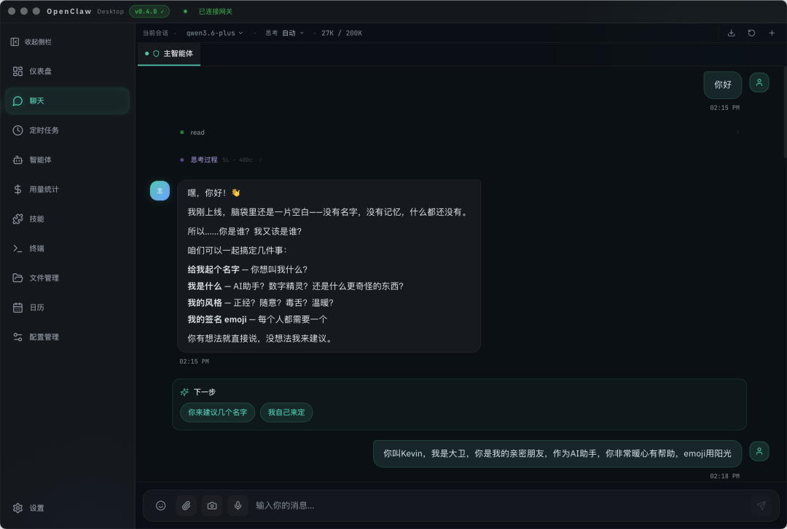
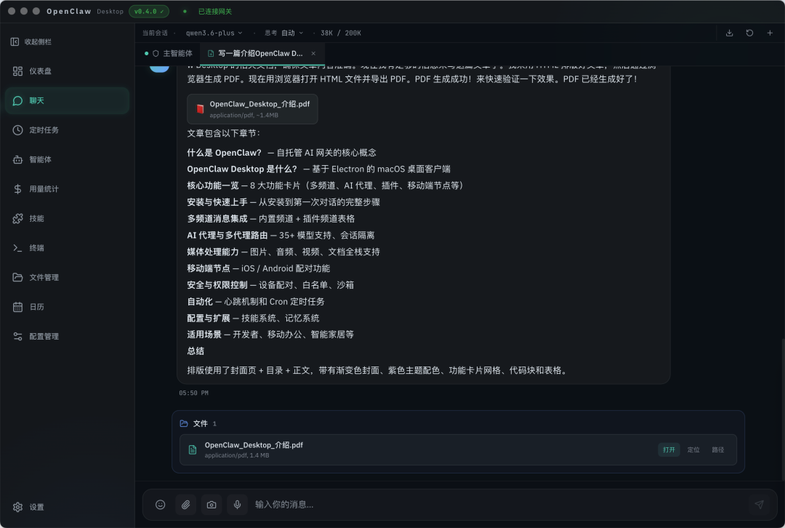
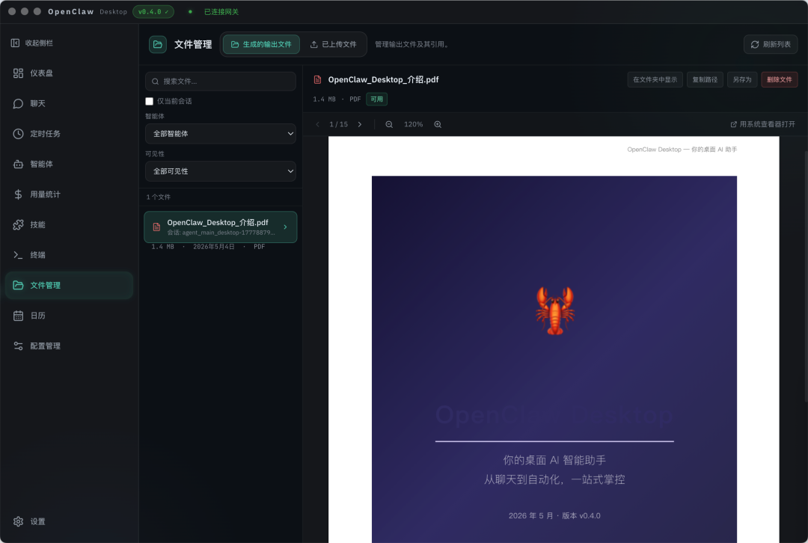
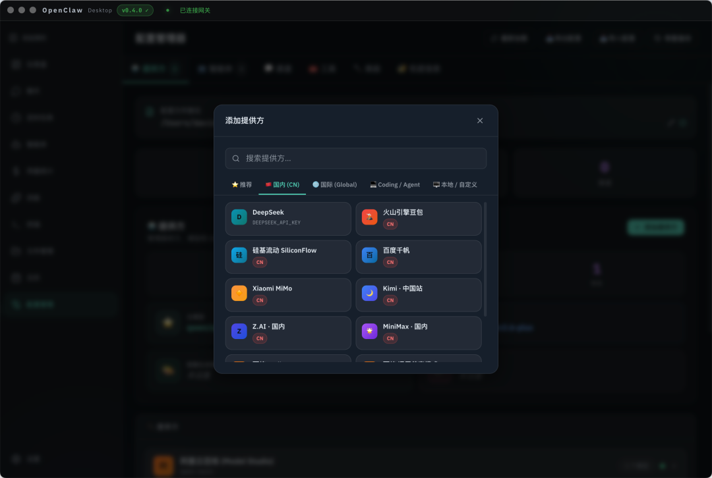
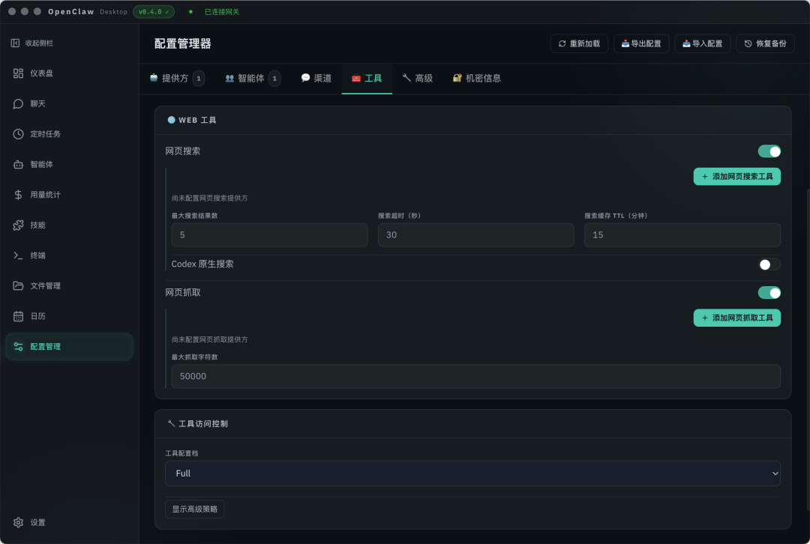
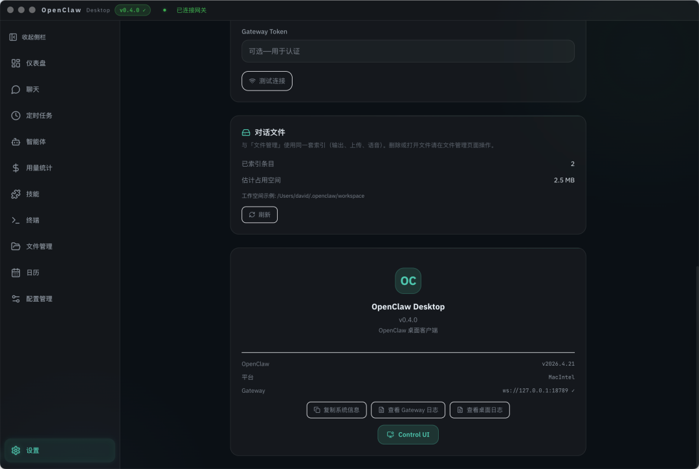
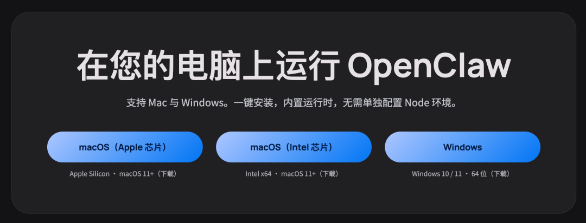

# OpenClaw Desktop

English | [简体中文](./README.zh-CN.md)

OpenClaw Desktop is a cross-platform desktop workspace for OpenClaw.

It turns a workflow that often starts in terminals, config files, and manual setup into a desktop product that is easier to install, understand, configure, and use every day. Whether you are an individual user, a developer, or a team running long-lived AI agents, OpenClaw Desktop gives you a unified place to manage chat, model providers, skills, automation, and agent operations.

## Overview

OpenClaw is powerful, but not everyone wants to begin with CLI commands, environment variables, and hand-edited configuration.

OpenClaw Desktop focuses on these common adoption barriers:

- Setup friction: download and run instead of building an environment from scratch
- Configuration complexity: manage providers, agents, channels, secrets, and tools visually
- Fragmented workflows: keep chat, skills, files, terminal, memory, and analytics in one workspace
- Maintenance overhead: make updates, connectivity, recovery, and diagnostics part of the default experience
- Low first-run success: help users reach a working result faster

## Key Features

### Out-of-the-box desktop experience

- One-click startup without requiring a manual Node.js installation
- Automatic updates
- Currently ships installers for macOS and Windows
- Better suited for always-available daily use, not just one-off experiments

### Workspace built for real usage

- Modern chat interface and multi-page desktop workspace
- Unified access to chat, configuration, skills, files, terminal, and analytics
- Helps turn OpenClaw from "it runs" into "it is usable every day"

### Visual OpenClaw configuration

- Manage AI providers, agents, channels, secrets, and tools through the UI
- Reduce direct editing of config files
- Make core setup more approachable for non-engineering users

### Skills and extensibility

- Built-in Skills page
- Browse, install, import, and manage skills
- Import local skills
- Discover capabilities from skill directories and skill marketplaces

### Automation and multi-agent workflows

- Schedule recurring tasks and automated runs
- Organize multi-agent workflows
- Support long-running and scenario-based agent operations

### Desktop-native integration

- Automatic updates
- Tray and system integration
- Local runtime management
- More reliable OpenClaw desktop experience

## Typical Use Cases

- Build a personal AI assistant workspace
- Manage multi-agent setups and runtime status
- Install and maintain skill stacks
- Run scheduled tasks and automated workflows
- Review files, logs, terminal output, and analytics
- Use OpenClaw as a desktop control center

## Screenshots

The following screenshots are taken from the `v0.4.0` release article and show the actual product UI.

### Chat and result rendering



### File result cards



### File management and preview



### Provider selection



### Tool configuration



### Settings and connection details



## Installation

### Download Releases

For most users, the recommended path is to download a prebuilt installer from [GitHub Releases](https://github.com/wzdavid/openclaw-desktop/releases) instead of starting from source.



Currently published release packages:

| Platform | Recommended package |
|---|---|
| macOS Apple Silicon | `OpenClaw.Desktop-<version>-arm64.dmg` |
| macOS Intel | `OpenClaw.Desktop-<version>.dmg` |
| Windows x64 | `OpenClaw.Desktop.Setup.<version>.exe` |

Notes:

- Linux builds are not currently published
- macOS users should prefer `.dmg`
- Windows users should prefer `.exe`
- `.zip` files are mainly useful for portable or manual extraction workflows

### Start Using It

On first launch, the typical setup flow is:

1. Connect to or initialize OpenClaw Gateway
2. Configure an AI provider
3. Choose a default model
4. Install required skills
5. Create your first agent or start chatting immediately

## Quick Start

### Development

```bash
npm install
npm run bundle:node        # macOS / Linux
npm run bundle:node:win    # Windows
npm run dev
```

### Build

```bash
npm run build:mac
npm run build:win
npm run build:linux
```

Build artifacts are generated in the `release/` directory by default.

## Compared With A Traditional OpenClaw Workflow

| Scenario | Traditional workflow | OpenClaw Desktop |
|---|---|---|
| Setup and launch | Prepare environment and commands | Start directly from a desktop app |
| Provider configuration | Edit config manually | Visual management |
| Skill management | CLI or manual directory operations | Graphical browsing and management |
| Feature entry points | Split across CLI, files, and web | Unified in one desktop workspace |
| Day-to-day usage | Engineering-heavy | Better for regular personal and team use |

## CI/CD

- `Build` workflow: build validation and artifact upload without publishing
- `Release` workflow: publish to GitHub Releases when a `v*` tag is pushed

Release example:

```bash
git tag v1.0.0
git push origin v1.0.0
```

## Documentation

- English docs: `docs/README.md`
- Chinese docs: `docs/README.zh-CN.md`
- Build and release configuration: `docs/build-release/config-build-release.md`
- Open-source readiness checklist: `docs/open-source-checklist.md`
- FAQ and troubleshooting: `docs/support/faq-and-troubleshooting.md`
- Contributing guide: `CONTRIBUTING.md` | Chinese: `CONTRIBUTING.zh-CN.md`
- Security policy: `SECURITY.md` | Chinese: `SECURITY.zh-CN.md`

## Acknowledgements

OpenClaw Desktop is inspired by and builds on the work of:

1. OpenClaw: https://github.com/openclaw/openclaw
2. AEGIS Desktop: https://github.com/rshodoskar-star/openclaw-desktop

## License

This project is licensed under the MIT License. See `LICENSE` for details.
