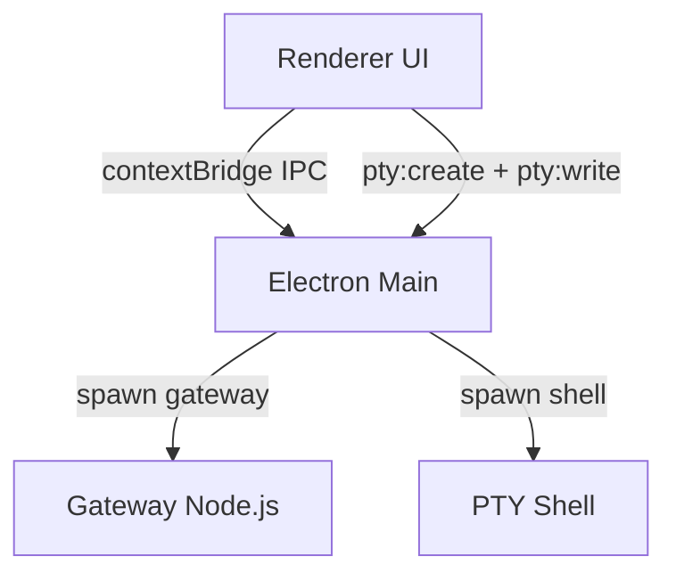

# OpenClaw Desktop 安全隔离加固方案

> 计划说明：本文件只用于文档化和后续版本的实施规划，不包含任何代码改动。

## 目标

把 OpenClaw Desktop 的安全隔离从「尽量不让渲染进程直接拿到权限」提升为「即便渲染进程被注入脚本劫持，也无法通过 IPC 形成任意文件读写、任意命令执行或任意网络暴露」。

## 当前架构与威胁面

OpenClaw Desktop 的安全边界主要由三层组成：

1. 渲染进程（UI）
2. Electron 主进程（IPC 桥接与文件系统、子进程控制点）
3. 子进程（OpenClaw gateway 与 PTY shell）



### 目前已经做到的基线保护

- 主窗口关闭 `nodeIntegration` 且启用 `contextIsolation`，渲染进程默认无法直接使用 Node.js 能力。
  - 参考：`electron/main.ts`
  - 片段：`webPreferences.nodeIntegration: false` + `contextIsolation: true`（`openclaw-desktop/electron/main.ts:325-331`）
- Preview 窗口显式开启 `sandbox: true`（`openclaw-desktop/electron/main.ts:657-666`）
- gateway 侧默认 bind 模式以 loopback 为主，并且对于非 loopback 绑定存在“必须配置 auth 才能继续”的启动保护。
- gateway token 校验在网关协议层完成，并使用常量时间比较避免时序侧信道（见 `openclaw/src/gateway/*` 的实现）

### 网络暴露与鉴权现状

#### 1. bind=loopback 的策略回退

在 gateway 绑定策略中，默认会优先尝试绑定 `127.0.0.1`，失败才回退到 `0.0.0.0`：

```text
openclaw/src/gateway/net.ts:246-258
if (mode === "loopback") {
  if (await canBindToHost("127.0.0.1")) {
    return "127.0.0.1";
  }
  return "0.0.0.0"; // extreme fallback
}
```

同时，如果绑定到非 loopback 且未配置共享密钥，则网关会拒绝启动：

```text
openclaw/src/gateway/server-runtime-config.ts:130-147
if (!isLoopbackHost(bindHost) && !hasSharedSecret && authMode !== "trusted-proxy") {
  throw new Error(
    `refusing to bind gateway to ${bindHost}:${params.port} without auth (set gateway.auth.token/password, or set OPENCLAW_GATEWAY_TOKEN/OPENCLAW_GATEWAY_PASSWORD)`,
  );
}
if (controlUiEnabled && !isLoopbackHost(bindHost) && controlUiAllowedOrigins.length === 0 && !dangerouslyAllowHostHeaderOriginFallback) {
  throw new Error(
    "non-loopback Control UI requires gateway.controlUi.allowedOrigins (set explicit origins), or set gateway.controlUi.dangerouslyAllowHostHeaderOriginFallback=true to use Host-header origin fallback mode",
  );
}
```

#### 2. token 生成与持久化

当没有 token 配置时，网关会生成随机 token，并在需要时写入配置：

```text
openclaw/src/gateway/startup-auth.ts:256-274
const generatedToken = crypto.randomBytes(24).toString("hex");
...
if (persist) {
  await writeConfigFile(nextCfg);
}
```

#### 3. token 校验

当客户端提供的 token 与配置 token 不一致时，网关会记录失败并返回 unauthorized。
其比较使用常量时间比较函数 `safeEqualSecret`：

```text
openclaw/src/gateway/auth.ts:439-455
if (!safeEqualSecret(connectAuth.token, auth.token)) {
  limiter?.recordFailure(ip, rateLimitScope);
  return { ok: false, reason: "token_mismatch" };
}
limiter?.reset(ip, rateLimitScope);
return { ok: true, method: "token" };
```

#### 4. Desktop 对 token 的传递方式

Desktop 打开控制台窗口时，会从磁盘读取 token，然后以 URL hash 片段方式注入：

```text
openclaw-desktop/electron/main.ts:1212-1217
const loadUrl = token
  ? `${targetUrl}#token=${encodeURIComponent(token)}`
  : targetUrl;
```

同时 gateway 子进程的启动参数当前只传了端口与 `--allow-unconfigured`，没有显式传 `--bind loopback`：

```text
openclaw-desktop/electron/node-manager.ts:63-75
this.process = spawn(
  nodePath,
  [
    openclawPath,
    'gateway',
    '--port', String(this.serverPort),
    '--allow-unconfigured',
  ],
  { stdio: ['ignore', 'pipe', 'pipe'], env: { ...process.env } }
);
```

因此后续加固方案中，建议在 Desktop 侧显式增加 `--bind loopback`，让绑定策略不依赖用户侧配置文件的覆盖。

## 关键风险清单（后续 P0 需要修复）

当渲染进程被 XSS 或注入劫持后，攻击者将利用 `preload.ts` 暴露的 IPC API 去调用 Electron 主进程。
一旦主进程存在“任意文件读写”或“任意命令/子进程控制”，威胁会立刻从“渲染层问题”升级为“本机账户完全沦陷”。

### 风险 1：IPC 路径遍历与任意文件读写（高风险，所有平台）

#### `config:read` 允许渲染器提供任意路径

```text
openclaw-desktop/electron/main.ts:500-518
ipcMain.handle('config:read', (_e, inputPath?: string) => {
  try {
    const configPath = inputPath || detectOpenClawConfigPath();
    const raw = fs.readFileSync(configPath, 'utf-8');
    ...
    return { data, path: configPath };
  } catch (err: any) {
    throw new Error(`Failed to read config: ${err.message}`);
  }
});
```

#### `config:write` 允许渲染器提供任意写入路径并创建目录

```text
openclaw-desktop/electron/main.ts:520-534
ipcMain.handle('config:write', (_e, { path: configPath, data }: { path?: string; data: object }) => {
  try {
    const targetPath = configPath || detectOpenClawConfigPath();
    if (fs.existsSync(targetPath)) fs.copyFileSync(targetPath, `${targetPath}.bak`);
    const dir = path.dirname(targetPath);
    const base = path.basename(targetPath);
    const hostBackupPath = path.join(dir, `.${base}.host-backup`);
    if (fs.existsSync(hostBackupPath)) fs.unlinkSync(hostBackupPath);
    fs.mkdirSync(path.dirname(targetPath), { recursive: true });
    fs.writeFileSync(targetPath, JSON.stringify(data, null, 2) + '\n', 'utf-8');
    return { success: true };
  } catch (err: any) {
    return { success: false, error: err.message };
  }
});
```

#### `memory:readLocal` 允许渲染器提供任意目录并读取文件

```text
openclaw-desktop/electron/main.ts:757-777
ipcMain.handle('memory:readLocal', async (_e, dirPath: string) => {
  try {
    const files: ...[] = [];
    const memoryMd = path.join(dirPath, 'MEMORY.md');
    ...
    const entries = fs.readdirSync(dirPath)...
    ...
    return { success: true, files };
  } catch (e: any) {
    return { success: false, error: e.message, files: [] };
  }
});
```

#### `file:read` 与 `voice:*` 提供任意路径读能力

```text
openclaw-desktop/electron/main.ts:814-829
ipcMain.handle('file:read', async (_e, filePath: string) => {
  try {
    const data = fs.readFileSync(filePath);
    ...
    return { name: path.basename(filePath), path: filePath, base64: data.toString('base64'), ... };
  } catch { return null; }
});
```

```text
openclaw-desktop/electron/main.ts:837-853
ipcMain.handle('voice:read', async (_e, filePath: string) => {
  try {
    const resolvedPath = path.isAbsolute(filePath)
      ? filePath
      : path.join(config.sharedFolder, 'voice', filePath);
    if (!fs.existsSync(resolvedPath)) return null;
    return fs.readFileSync(resolvedPath).toString('base64');
  } catch { return null; }
});
```

### 风险 2：内置终端 PTY 允许任意 cwd 并提供任意交互（高风险）

```text
openclaw-desktop/electron/main.ts:856-889
ipcMain.handle('pty:create', (_e, options?: { cols?: number; rows?: number; cwd?: string }) => {
  ...
  const shell = process.env.SHELL || (process.platform === 'win32' ? 'powershell.exe' : '/bin/bash');
  ...
  const ptyProcess = pty!.spawn(shell, [], {
    name: 'xterm-256color',
    cols: options?.cols || 80,
    rows: options?.rows || 24,
    cwd: options?.cwd || os.homedir(),
    env,
  });
  ...
});

openclaw-desktop/electron/main.ts:890-892
ipcMain.handle('pty:write', (_e, id: string, data: string) => {
  ptyProcesses.get(id)?.write(data);
});
```

一旦渲染进程被劫持，攻击者可以通过 `pty:write` 直接在用户权限下执行任意 shell 命令。

### 风险 3：CSP 允许 unsafe-eval 与 unsafe-inline（高风险）

当前 CSP 字符串里包含 `unsafe-eval` 和 `unsafe-inline`，使 XSS 防护显著削弱：

```text
openclaw-desktop/electron/main.ts:352-363
'Content-Security-Policy': [
  "default-src 'self' 'unsafe-inline' 'unsafe-eval' data: blob:; " +
  "script-src 'self' 'unsafe-inline' 'unsafe-eval' https:; " +
  ...
]
```

### 风险 4：Console 窗口 openExternal 无 scheme 校验（中风险）

```text
openclaw-desktop/electron/main.ts:1221-1225
consoleWindow.webContents.setWindowOpenHandler(({ url: href }) => {
  shell.openExternal(href);
  return { action: 'deny' };
});
```

如果未来某些路径允许注入到 href，可能出现 `file://`、`javascript:` 等 scheme 风险。

### 风险 5：skillshub CLI 自动安装直接执行远程脚本（高风险修复项）

```text
openclaw-desktop/electron/main.ts:38-56, 1673-1687
// macOS / Linux
execFileSync('/bin/bash', [
  '-c',
  'curl -fsSL https://skillhub-1388575217.cos.ap-guangzhou.myqcloud.com/install/install.sh | bash -s -- --cli-only',
], { timeout: 120_000 });
```

```text
openclaw-desktop/electron/main.ts:44-56, 1677-1681
// Windows
execFileSync('powershell', [
  '-NoProfile', '-NonInteractive', '-Command',
  "$ErrorActionPreference='Stop'; ... Invoke-WebRequest -Uri 'https://skillhub-1388575217.cos.ap-guangzhou.myqcloud.com/install/latest.tar.gz' ...",
], { timeout: 120_000 });
```

## 分层加固方案（8 层，按优先级）

### P0 第一层：IPC 白名单与路径限制（所有平台，优先级最高）

核心原则：**从源头收紧 IPC 的输入，让渲染器无法提供任意路径。**

建议实现方式：

1. 在 `electron/main.ts` 新增通用校验函数：解析绝对路径后确保落在允许根目录内
2. 对以下 handler 做强制限制（默认拒绝，只有确认为安全的路径才放行）：
   - `config:read/config:write`：只允许读取/写入 `detectOpenClawConfigPath()` 返回的目标文件或其固定同目录文件（例如 `clawdbot.json` 与 `openclaw.json` 这类）
   - `memory:readLocal`：只允许 `~/.openclaw/memory` 或用户选择后的对话框路径（需将用户选择作为“一次性授权”，并用会话缓存 token）
   - `file:read`：优先移除任意路径读，改为 `file:openDialog` 选择后读取文件
   - `voice:read/voice:save`：不允许 absolute path；强制 `filename` 取 `basename()` 并限制在 `config.sharedFolder/voice` 下
3. `pty:create` 的 `options.cwd`：只允许落在 `os.homedir()` 或更小的安全目录集合

此层改动将最大程度降低“渲染器劫持 -> 任意文件系统读写”的风险。

### P0 第二层：主窗口全局沙箱与导航拦截（所有平台）

建议至少做到两点：

1. 在 `app.whenReady()` 之前启用进程级沙箱（仅当 Electron 版本与组件兼容验证通过）
2. 主窗口与控制台窗口增加 `window.open`、导航事件拦截：
   - `setWindowOpenHandler` 添加 scheme allowlist（只允许 `http/https`，必要时允许 `mailto` 等明确白名单）
   - 主窗口增加 `will-navigate` 拦截，阻断跳转到外部页面或非预期协议

对于主窗口的 webPreferences，建议目标最终态包含 `sandbox: true`。

### P1 第三层：CSP 收紧（所有平台）

分阶段：

1. 阶段 A 立即移除 `unsafe-eval`（`script-src` 中）
2. 阶段 B 引入 nonce-based CSP 或 build-time CSP 注入，移除 `unsafe-inline`

这层能降低 XSS 注入成功率，让前面的 IPC 限制更具防御意义。

### P1 第四层：子进程环境隔离（所有平台）

当前 `gateway` 与 `pty` 均可能继承完整 `process.env`。

建议：

1. 为子进程实现环境变量 allowlist（保留路径、语言、必要的 openclaw 配置相关键）
2. 限制 shell 与 PATH 执行路径（避免环境可控导致的可执行文件劫持）

### P1 第五层：gateway 子进程 spawn 参数加固（所有平台）

建议在 gateway 启动命令中显式加：

- `--bind loopback`

以防止用户侧配置覆盖导致 gateway 暴露到非 loopback 网络。

可选加固：

- 避免 token 通过 URL 传递（减少 token 落入日志、剪贴板、历史记录的风险）

### P2 第六层：macOS 平台加固

1. 代码签名与 entitlements：
   - 维持 `hardenedRuntime: true`
   - 增加最小化 entitlements 文件以支持 Electron 渲染与 native module 行为
2. 长期方向：
   - 评估是否可以逐步引入更强的 App Sandbox
   - 由于 node-pty 属于 native 能力，sandbox 与 PTY 需要兼容性验证，可能需要拆出独立 helper 模块或服务进程

### P2 第七层：Windows 平台加固

重点是“子进程不会越界”和“安装器不引入弱权限”：

1. gateway 与 PTY 子进程禁止不必要的分离/隐藏行为，确保其生命周期与父进程一致
2. NSIS 安装流程中避免将敏感目录放在普通用户可写目录下（防止 DLL 劫持与路径污染）
3. 完整启用 Windows 代码签名与发布签名链验证

### P3 第八层：skillshub 安装安全改造

把“远程脚本直接执行”改为：

1. 下载到临时文件后校验 SHA256 或签名
2. 才允许执行
3. 对 `slug` 参数做严格正则校验，避免命令注入与路径穿越

## 实施路线表（文档化，不执行）

| 优先级 | 目标改动 | 受影响模块 | 估计工作量 |
|---|---|---|---|
| P0 | IPC 路径白名单与 handler 输入限制 | `electron/main.ts` | ~60 行 |
| P0 | 主窗口 sandbox 与导航/新窗口拦截 | `electron/main.ts` | ~20 行 |
| P1 | CSP 移除 unsafe-eval，规划 nonce | `electron/main.ts` + 构建配置 | ~2 行到中等规模 |
| P1 | 子进程 env allowlist | `electron/node-manager.ts` + PTY 创建 | ~30 行 |
| P1 | gateway 显式 bind loopback | `electron/node-manager.ts` | ~2 行 |
| P2 | macOS entitlements 文件与签名策略 | `package.json` + `resources/` | ~30 行 |
| P2 | Windows 子进程生命周期与安装器权限 | `electron/*` + `package.json` | ~10 行 |
| P3 | skillshub 安装脚本安全化 | `electron/main.ts` | ~40 行 |

## 安全回归验证建议（未来可用作测试用例）

当实施每一层时，建议增加以下检查：

1. IPC 路径遍历回归测试：
   - `config:read` 使用 `../` 或 absolute path 是否被拒绝
   - `file:read` 是否只能读取用户选择的文件
2. PTY 限制回归测试：
   - `pty:create` 的 `cwd` 不在允许集时是否拒绝
3. CSP 回归测试：
   - XSS payload 是否仍能执行（至少在自动化层面判断脚本执行被阻断）
4. 网络暴露回归测试：
   - gateway bind 维持 loopback，不依赖用户配置

## 参考片段索引

- 主窗口 webPreferences 与 CSP 注入：`openclaw-desktop/electron/main.ts:325-372`
- config:read 与 config:write：`openclaw-desktop/electron/main.ts:500-534`
- memory:readLocal：`openclaw-desktop/electron/main.ts:757-777`
- file:read：`openclaw-desktop/electron/main.ts:814-829`
- voice:read：`openclaw-desktop/electron/main.ts:847-853`
- PTY create 与 write：`openclaw-desktop/electron/main.ts:856-892`
- Console openExternal handler：`openclaw-desktop/electron/main.ts:1221-1225`
- skillshub installCli：`openclaw-desktop/electron/main.ts:956-969`
- Preview sandbox：`openclaw-desktop/electron/main.ts:657-666`
