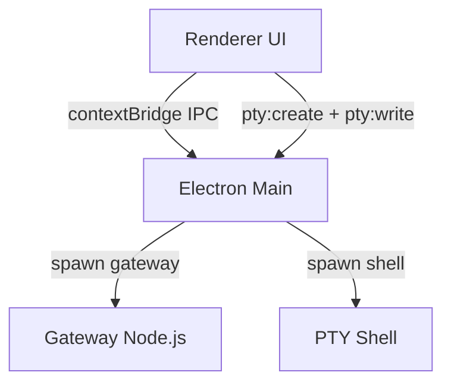

# OpenClaw Desktop Security Hardening Plan

[English](./security-hardening.md) | [简体中文](./security-hardening.zh-CN.md)

> Planning note: this file documents the security posture and future hardening roadmap only. It does not change code by itself.

## Goal

Raise OpenClaw Desktop from "try not to give the renderer direct privileges" to a stronger posture where even a compromised renderer cannot turn IPC into arbitrary file access, arbitrary command execution, or unintended network exposure.

## Current Architecture and Threat Surface

The main trust boundaries are:

1. the renderer process (UI)
2. the Electron main process (IPC bridge, filesystem operations, and child-process control)
3. child processes such as the OpenClaw Gateway and the PTY shell



### Existing baseline protections

- The main window disables `nodeIntegration` and enables `contextIsolation`, so the renderer cannot directly use Node.js APIs by default.
- The preview window explicitly enables `sandbox: true`.
- Gateway binding prefers loopback by default, and non-loopback binds require explicit authentication before startup succeeds.
- Gateway token comparison uses constant-time secret comparison in the protocol layer.

### Network exposure and authentication status

#### 1. Loopback bind fallback

Gateway binding currently prefers `127.0.0.1` and only falls back to `0.0.0.0` when loopback binding is unavailable:

```text
openclaw/src/gateway/net.ts:246-258
if (mode === "loopback") {
  if (await canBindToHost("127.0.0.1")) {
    return "127.0.0.1";
  }
  return "0.0.0.0"; // extreme fallback
}
```

If the final bind host is not loopback and no shared secret is configured, the gateway refuses to start.

#### 2. Token generation and persistence

When no token is configured, the gateway generates a random token and may write it back to config.

#### 3. Token validation

When the provided token does not match the configured token, the gateway records the failure and returns unauthorized using `safeEqualSecret`.

#### 4. How Desktop passes the token

Desktop currently reads the token from disk and injects it into the console URL hash. The gateway child process is started with a port and `--allow-unconfigured`, but Desktop does not explicitly add `--bind loopback`.

Because of that, a future hardening step should pass `--bind loopback` explicitly from Desktop so network exposure does not depend on user config overrides.

## Key Risks That Need Follow-Up

If the renderer is compromised through XSS or script injection, an attacker can call the IPC APIs exposed through `preload.ts`. Once the main process exposes arbitrary file operations or child-process control, the threat jumps from a renderer issue to full compromise of the local user account.

### Risk 1: IPC path traversal and arbitrary file access

High-risk examples include:

- `config:read` accepts an arbitrary path from the renderer
- `config:write` accepts an arbitrary target path and can create directories
- `memory:readLocal` accepts an arbitrary directory and reads files
- `file:read` and some `voice:*` handlers expose broad path-based read behavior

These handlers need explicit root restrictions rather than trusting renderer-provided paths.

### Risk 2: Built-in PTY allows arbitrary `cwd` and interactive command execution

The PTY creation flow allows the renderer to provide `cwd`, and `pty:write` can then send arbitrary shell input. If the renderer is compromised, this becomes direct local command execution under the user's account.

### Risk 3: CSP still allows `unsafe-eval` and `unsafe-inline`

The current Content Security Policy allows both `unsafe-eval` and `unsafe-inline`, which significantly weakens XSS resistance.

### Risk 4: Console `openExternal` does not validate URL schemes

If attacker-controlled content reaches `shell.openExternal`, unsupported schemes such as `file://` or `javascript:` could become dangerous.

### Risk 5: skillshub CLI install path executes remote scripts directly

The current install flow downloads and executes remote scripts or archives directly, which should be replaced with a verified-download path.

## Layered Hardening Plan

### P0 Layer 1: IPC allowlists and path restrictions

Core rule: tighten IPC inputs at the source so the renderer cannot supply arbitrary paths.

Recommended actions:

1. Add a shared path-validation helper in `electron/main.ts`.
2. Restrict these handlers by default:
   - `config:read` and `config:write`: allow only the detected OpenClaw config path and tightly related files
   - `memory:readLocal`: allow only `~/.openclaw/memory` or user-approved paths from a file picker
   - `file:read`: prefer replacing arbitrary path reads with a user-selection flow
   - `voice:read` and `voice:save`: reject absolute paths and confine file names under `config.sharedFolder/voice`
3. Restrict `pty:create.options.cwd` to `os.homedir()` or a smaller trusted directory set

This is the most important layer for reducing arbitrary filesystem access after renderer compromise.

### P0 Layer 2: Main-window sandboxing and navigation interception

At minimum:

1. Enable process-level sandboxing before `app.whenReady()` if compatibility checks pass.
2. Add navigation and popup interception to the main and console windows:
   - `setWindowOpenHandler` with an explicit scheme allowlist such as `http`, `https`, and possibly `mailto`
   - `will-navigate` interception to block unexpected external pages and protocols

The long-term target should include `sandbox: true` for the main window as well.

### P1 Layer 3: Tighten CSP

Phased plan:

1. remove `unsafe-eval` first
2. move toward nonce-based or build-time CSP injection so `unsafe-inline` can also be removed

This improves XSS resilience and makes IPC restrictions more meaningful.

### P1 Layer 4: Child-process environment isolation

Today both the gateway and PTY may inherit the full `process.env`.

Recommended actions:

1. implement an environment-variable allowlist for child processes
2. restrict shell and `PATH` resolution to reduce executable hijacking risk

### P1 Layer 5: Harden gateway spawn parameters

Desktop should explicitly add:

- `--bind loopback`

Optional extra hardening:

- avoid passing tokens through URLs when possible

### P2 Layer 6: macOS hardening

1. Keep `hardenedRuntime: true`.
2. Add minimal entitlements required by Electron and native modules.
3. Evaluate stronger sandboxing over time, noting that `node-pty` may require helper-process or compatibility work.

### P2 Layer 7: Windows hardening

Focus on keeping child processes inside expected boundaries and avoiding installer-time weak permissions:

1. keep gateway and PTY child-process lifecycle tied to the parent app
2. avoid install locations that enable DLL hijacking or path pollution
3. fully enable Windows code signing and release signature validation

### P3 Layer 8: Secure skillshub installation

Replace direct remote script execution with:

1. download to a temporary file
2. verify SHA256 or a signature
3. execute only after verification
4. validate parameters such as `slug` with strict regex rules

## Implementation Roadmap

| Priority | Change | Affected Modules | Estimated Effort |
|---|---|---|---|
| P0 | IPC allowlists and handler input restrictions | `electron/main.ts` | ~60 lines |
| P0 | Main-window sandboxing and navigation interception | `electron/main.ts` | ~20 lines |
| P1 | Remove `unsafe-eval` and plan nonce CSP | `electron/main.ts` + build config | ~2 lines to medium effort |
| P1 | Child-process env allowlist | `electron/node-manager.ts` + PTY creation | ~30 lines |
| P1 | Explicit `--bind loopback` for gateway | `electron/node-manager.ts` | ~2 lines |
| P2 | macOS entitlements and signing policy | `package.json` + `resources/` | ~30 lines |
| P2 | Windows child-process lifecycle and installer permissions | `electron/*` + `package.json` | ~10 lines |
| P3 | Secure skillshub installer flow | `electron/main.ts` | ~40 lines |

## Suggested Security Regression Checks

As each layer lands, add checks such as:

1. IPC traversal regressions
   - does `config:read` reject `../` and unrelated absolute paths
   - does `file:read` only read user-selected files
2. PTY restrictions
   - does `pty:create` reject `cwd` values outside the trusted set
3. CSP regressions
   - can basic XSS payloads still execute
4. Network exposure regressions
   - does gateway remain loopback-bound regardless of user overrides

## Reference Snippets

- Main-window `webPreferences` and CSP injection: `openclaw-desktop/electron/main.ts:325-372`
- `config:read` and `config:write`: `openclaw-desktop/electron/main.ts:500-534`
- `memory:readLocal`: `openclaw-desktop/electron/main.ts:757-777`
- `file:read`: `openclaw-desktop/electron/main.ts:814-829`
- `voice:read`: `openclaw-desktop/electron/main.ts:847-853`
- PTY create and write: `openclaw-desktop/electron/main.ts:856-892`
- Console `openExternal` handler: `openclaw-desktop/electron/main.ts:1221-1225`
- `skillshub` CLI installation: `openclaw-desktop/electron/main.ts:956-969`
- Preview sandbox: `openclaw-desktop/electron/main.ts:657-666`
